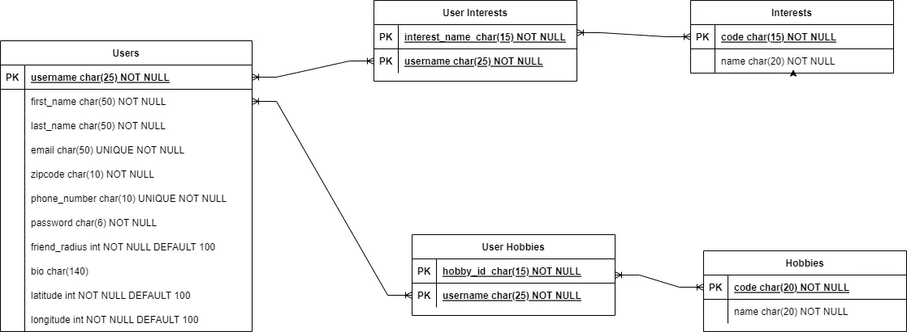

# Friender Todo Tracker

## Minimum Viable Product Stage

### Project Structure

- │ = ALT + 179
- └ = ALT + 192
- ├ = ALT + 195
- ─ = ALT + 196

``` arduino
Friender/
│
├── static/
│   └── css/
│       └── style.css
│
├── temp_photos/
│   └── default-pic.png
│
├── templates/
│   ├── users/
│   │   ├── delete.html
│   │   ├── edit.html
│   │   ├── index.html
│   │   ├── login.html
│   │   ├── match.html
│   │   ├── profile.html
│   │   └── signup.html
│   │
│   ├── _form.html
│   ├── 404.html
│   ├── base.html
│   ├── home-anon.html
│   └── home.html
│
├── app.py
├── forms.py
├── models.py
├── geocoding.py
├── README.md
├── requirements.txt
├── seed.py
└── upload.py

```

### **Design Files**

- **Entity Relationship Diagram**



- **Figma Design Mocks**


### [x] **Landing Page for Non-Logged-in Users**

- [x] Create a landing page that welcomes users and provides basic information about the platform.
- [x] Include a call-to-action button or link to the signup page.

### [x] **Homepage for Logged-in Users**

- [x] Develop a homepage layout for users who are logged in.
- [x] Display relevant information or actions such as profile updates, friend suggestions, or recent activity.

### [x] **Login Page**

- [x] Design a login page with fields for username and password.
- [x] Implement authentication logic to validate user credentials.
- [x] Include a link to the signup page for new users.

### [x] **Signup Page**

- [x] Create a signup form with fields for username, password, email, phone number, friend radius, profile photo, first name, and last name.
- [x] Implement form validation to ensure all required fields are filled.
- [x] Set up logic to create a new user account upon submission.

### [x] **Profile Page**

- [x] Design a profile page layout displaying user information in a bootstrap card format.
- [x] Include the user's profile photo, username, first name, last name, list of hobbies, list of interests, edit button, delete button.
- [x] Ensure that only the profile owner can view and edit their profile.
- [x] Implement delete route functionality

### [x] **Users Page**

- [x] Develop a page to display cards of all users on the site.
- [x] Each card should include the user's profile photo, username, first name, list of hobbies, and list of interests.
- [x] Enable users to click on a card to navigate to the respective user's profile page.

### [x] **CSRF Protection Form**

- [x] CSRF Protection form implemented

### [x] **User Login Form**

- [x] Create a form for users to login.
- [x] username, password

### [x] **User Signup Form**

- [x] Create a form for users to signup.
- [x] username, first_name, last_name, email, password, phone_number, zipcode

### [x] **Profile Edit Form**

- [x] Create a form for users to edit their profile information.
- [x] Allow users to upload a profile photo, modify their friend radius, update zipcode, and add interests and hobbies from dropdown lists.
- [x] Implement validation to handle edits appropriately.

### [x] **S3 Bucket Integration**

- [x] Use file input from Profile Edit form to save user submitted profile photo file to S3
- [x] Ensure that permissions allow read/write access to S3
- [x] Ensure read on /users, /users/<username> accesses profile photo correctly

### [x] **Routing and Navigation**

- [x] Set up routing logic to navigate between different pages of the application.
- [x] Ensure proper redirection based on user actions such as login, signup, profile edit, etc.
- [x] Delete route functionality

### [x] **Styling and UI Enhancement**

- [x] Apply CSS styling to improve the visual appearance and user experience of the pages.
- [x] Ensure consistency in design elements across the application.

### Notable Bugs

- **BUG STORY** - S3 integrations
  - use correct encoding to get the actual file in the form

- **BUG STORY** - db.relationships are good if you use them
  - remember that if you create it you must also call it when trying to access

  ```python
    users = db.relationship(
        'User',
        secondary="user_interests",
        backref="interests",
    )
  ```

- **BUG STORY** - class methods in models should be called in routes
  - if you create a class method to help with getting the data you need make sure to call it in the correct route

  ```python
    form = UserEditForm(obj=user)
    form.hobby.choices = Hobby.hobby_choices()
    form.interest.choices = Interest.interest_choices()
  ```

## Stretch Goals - Revision 1

### **Added a location table to db**

- [x] Create the table
- [x] add appropriate records: lat column - FLOAT, long column - FLOAT

### **Implement Geocoding for location based matches**

- [ ] Try to cache the longitude and latitude on user signup in the db
- [ ] Check for cached long/lat for /users/match search
- [ ****] Display users based on friend_radius in HTML

### **Multi-Select for Hobbies and Interests in EditProfileForm**

- [ ] Add multi-select field to form
- [ ] update to use checkbox widgets
- [ ] style to remove bullet-point markers

### Notable Bugs

- **BUG STORY**:
  - Sometimes documentation is not clear on how to use built-in functions for your use case
  - **** 1254, ဒဂုံဆိပ်ကမ်း, Yangon East, Yangon, ရန်ကုန်တိုင်းဒေသကြီး, မြန်မာ
  - **** Свобода, Батівська селищна громада, Берегівський район, 90210, Закарпатська область, Україна

- **BUG STORY**
  - In geocoder.py: make sure to use bracket notation to access values on a dict
  - dot notation may cause un-intended bugs
  - user.location != user["location"]

## Stretch Goals - Revision 2

### Add matches and messages functionality

### Add animations to match game

### Build out basic messaging inbox service

### Notable Bugs
